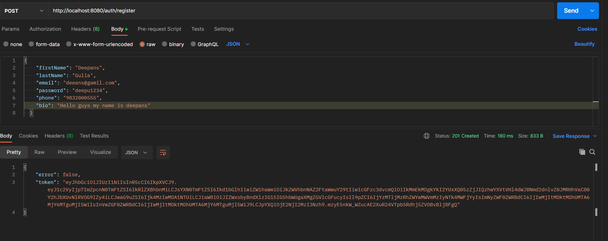
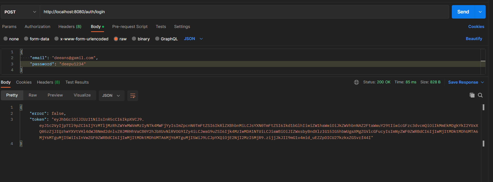
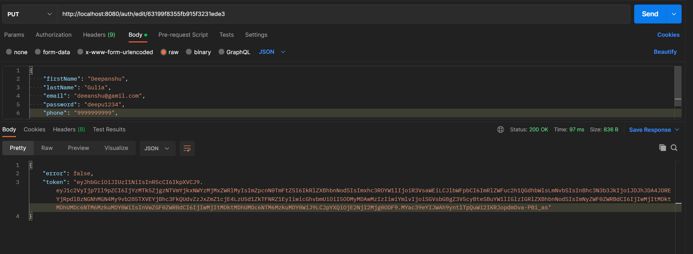
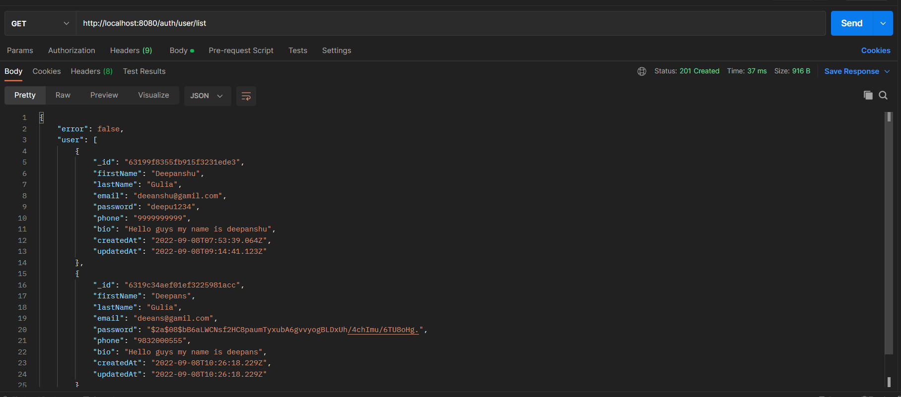
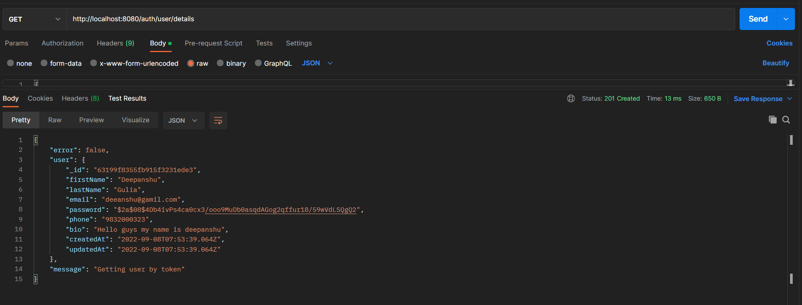
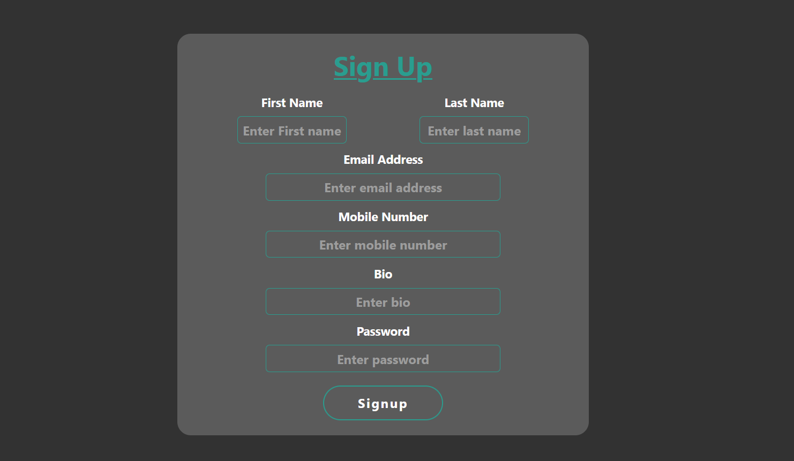
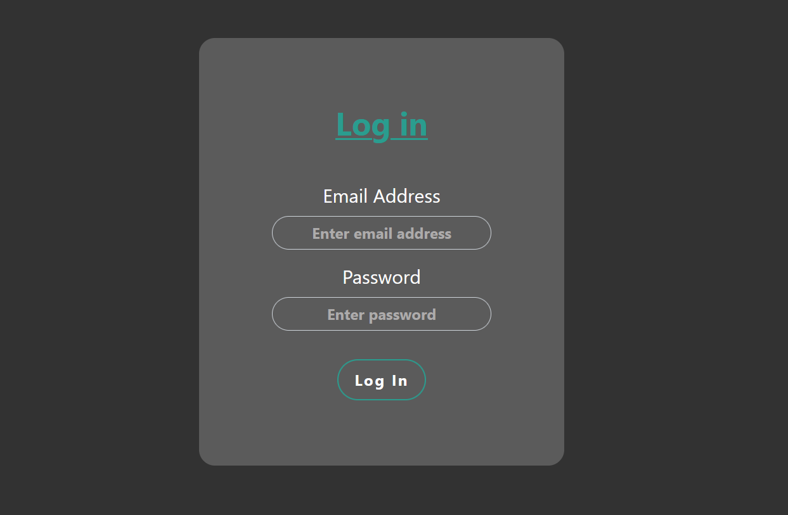
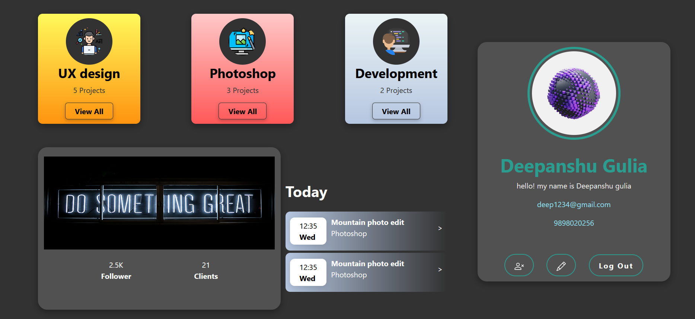

# backend_profile

## Steps to run application on local server
* Clone this repository locally than to following for starting local server for backend.
  
* <h1>npm install</h1> ==> After cloning this repository you can run npm install in terminal to download in project dependencies.

* <h1>npm start</h1> ==> After cloning this repository you can run npm start in terminal to start server on localhost:5000.

## TechStacks
* NodeJS
* JavaScript
* express
* Mongodb
* Mongoose
* cors
* nodemon
* Reactjs
* React-Router
* React-Redux

# Backend

* ##  Register new user 

* ## Login with user of email and password

* ##  Editing user data

* ##  Getting list of users data in database

* ##  Getting user data by token

# Frontend

* ##  Register new user 

* ## Login with user of email and password

* ##  user Profile page

Thank you ❤️
